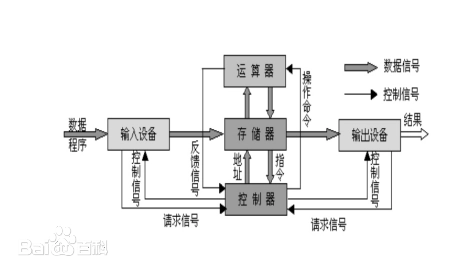
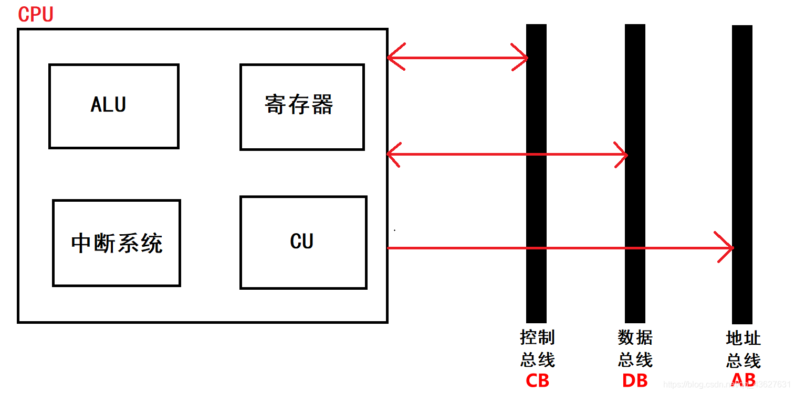
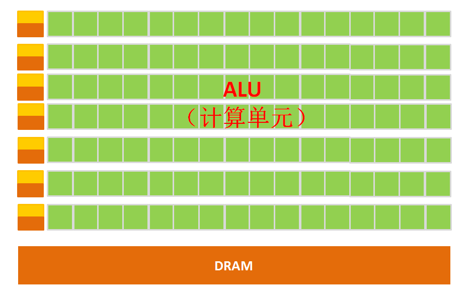
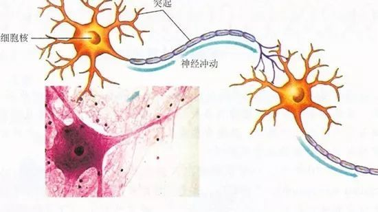
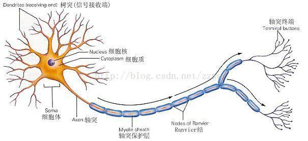
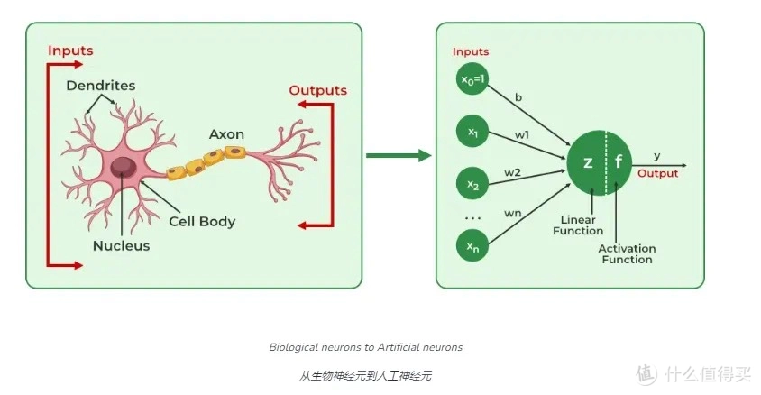
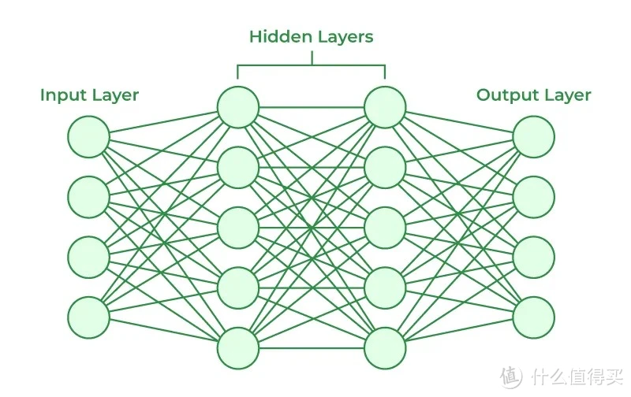
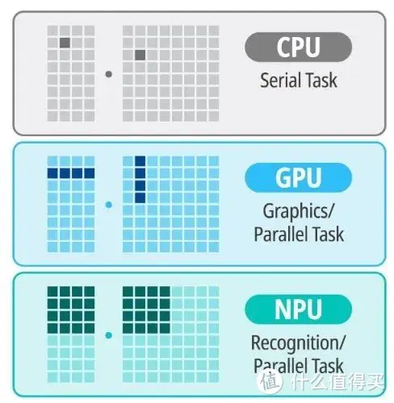

<!-- 
_class: lead
 -->

# 分享讨论
## （CPU、GPU、NPU）

---

# 冯·诺依曼结构
计算机制造的三个基本原则，即采用二进制逻辑、程序存储执行以及计算机由五个部分组成（运算器、控制器、存储器、输入设备、输出设备），这套理论被称为冯·诺依曼体系结构。

---

# CPU
**CPU**(中央处理器)
内部主要由以下几个核心部分构成：
- 运算器（ALU）<!--程序计数器/指令寄存器/指令译码器/控制电路-->
- 控制器（CU）<!--保存运算和控制过程中的数据-->
- 寄存器
- 中断系统

--- 

# CPU工作流程
<!--指令：操作码和地址码-->
1. 取指令：CPU从程序计数器（PC）中获取下一条指令的地址，然后从内存中取出指令并存放到指令寄存器（IR）中。
2. 指令译码：指令译码器（ID）对取出的指令进行解析，确定指令的类型和执行所需的操作。
3. 访存取数：如果指令需要操作数，CPU会访问内存以获取所需的数据
4. 执行指令：根据译码结果，运算器（ALU）执行指令规定的操作，如算术运算或逻辑运算。
5. 结果写回：将运算结果写回到指定的寄存器或内存地址中。

---

# GPU
从架构图看出，GPU构成与CPU的区别，GPU有成千个计算单元，构成超长的流水线，特别适合大量的类型统一的数据。但是GPU无法单独工作，须由CPU调用才能进行工作。

---

借用某个帖子的回答来形容GPU和CPU：假如你需要计算几亿次一百以内的加减乘除（前提这些计算互相不影响），最好的办法是雇佣很多小学生一起算，一人算一部分，因为这些计算没得啥技术含量，全是体力活；而CPU就像老教授，积分微分都会算，但是工资高。

---

# 人类的神经结构
生物的神经网络由若干个人工神经元结点互联而成，神经元之间通过突触两两连接，突触记录神经元之间的联系。

---

# NPU模拟人类的神经元和突触结构
设想一下每个神经元抽象为一个函数，函数的输入由其相连的神经元的输出以及连接神经元的突触共同决定。

--- 

- 神经元的输入经过加权和偏置后，通过线性变换得到输出：
$$ y = w_1 x_1 + w_2 x_2 + \dots + w_n x_n + b $$
- ReLU 函数
$$ \text{ReLU}(x) = \max(0, x) $$

---

为了达到接近想要的输出结果，使用者就必须通过（特定的算法）调整神经网络中的突触取值、网络的拓扑结构等，该过程称为“学习”。

故而引出一个问题，神经元的计算需要对多个输入进行加权求和、激励函数计算、错误反向传播等复杂步骤，这其中涉及大量的指令处理。

虽然GPU在并行计算能力上处于优势，对于神经网络模型的构建和数据流的传递还是在CPU上进行。同时存在功耗高，体积大的问题，性能越高的GPU体积越大、功耗越高、价格也昂贵，对于一些小型设备、移动设备来说将无法使用。因此，一种体积小、功耗低、计算性能高、计算效率高的专用芯片NPU诞生了。

---
NPU工作原理是在电路层模拟人类神经元和突触，并且用深度学习指令集直接处理大规模的神经元和突触，一条指令完成一组神经元的处理。相比于CPU和GPU，NPU通过突触权重实现存储和计算一体化，从而提高运行效率。

NPU是模仿生物神经网络而构建的，CPU、GPU处理器需要用数千条指令完成的神经元处理，NPU只要一条或几条就能完成，因此在深度学习的处理效率方面优势明显。实验结果显示，同等功耗下NPU的性能是GPU的118倍。

---

# NPU的市场发展趋势
鉴于NPU在AI计算任务中的显著优势，各大厂商纷纷推出自家的NPU产品。例如，英特尔、AMD、谷歌和华为等都已研发并推出了相应的NPU产品，用于提升AI设备的计算能力和能效。 

1. 英特尔： 开发了XPU混合算力解决方案，通过CPU、GPU和NPU的结合，大幅提升终端AI能力。 
2. 高通： 发布了集成ARM CPU与AI引擎NPU的芯片，优化AI性能，支持本地大模型运行。 
3. AMD： 推出了集成NPU模块的桌面级CPU，提升AI算力。 
4. 苹果： 在其M系列芯片中集成了NPU，用于提升设备端机器学习的速度和效率。

---

# 总结

简单来说，三者不同：CPU是线性、串行任务（指令）执行，效率较低，通用性较高；GPU是并行处理和专用图形并行处理，效率更高；而NPU则是“并行认知处理”，在AI机器学习方面，效率更高。

